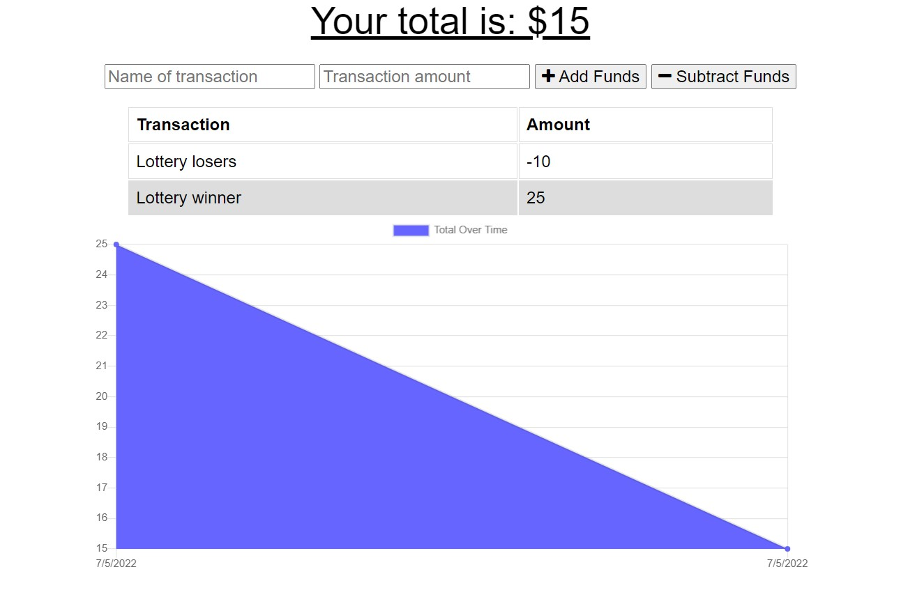

# Budget Tracker

## Table of Contents for Tech Blog
- [Description](#description)
- [Installation](#installation)
- [Usage](#usage)
- [License](#license)
- [Contributing](#contributing)
- [Tests](#tests)
- [Questions](#questions)
- [Heroku](#heroku)
- [Screenshot](#screenshot)

### Description
An application where users are able to add expenses and deposits to their budget with or without a connection.

### Installation
Clone the code from GitHub if you would like your own personal budget tracker. Or you can take a look at the live server on Heroku, however this is not private.

### Usage
Developers can track their budget over gaining and losing money. It also can utilize offline functionality, so the app is useful anywhere in the world.

### License

No License selected

### Contributing
Clone the code from GitHub if you would like your own personal budget tracker, anyone could add or subtract from this tracker so it is not private.

### Tests
This application is deployed on Heroku and could be used at your own leisure.

### Questions
If you have any questions, feel free to contact me via email, vdurham@prideseals.com, or visit my Github page at [vidurham](https://github.com/vidurham).

### Heroku
[Heroku Link](https://budget-tracker-2244.herokuapp.com/)

### Screenshot
